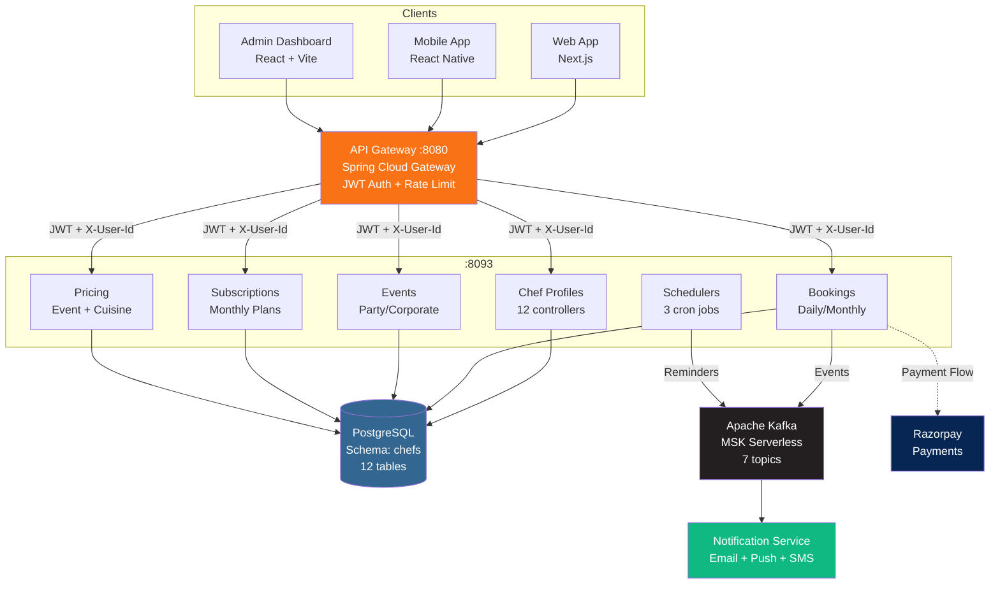
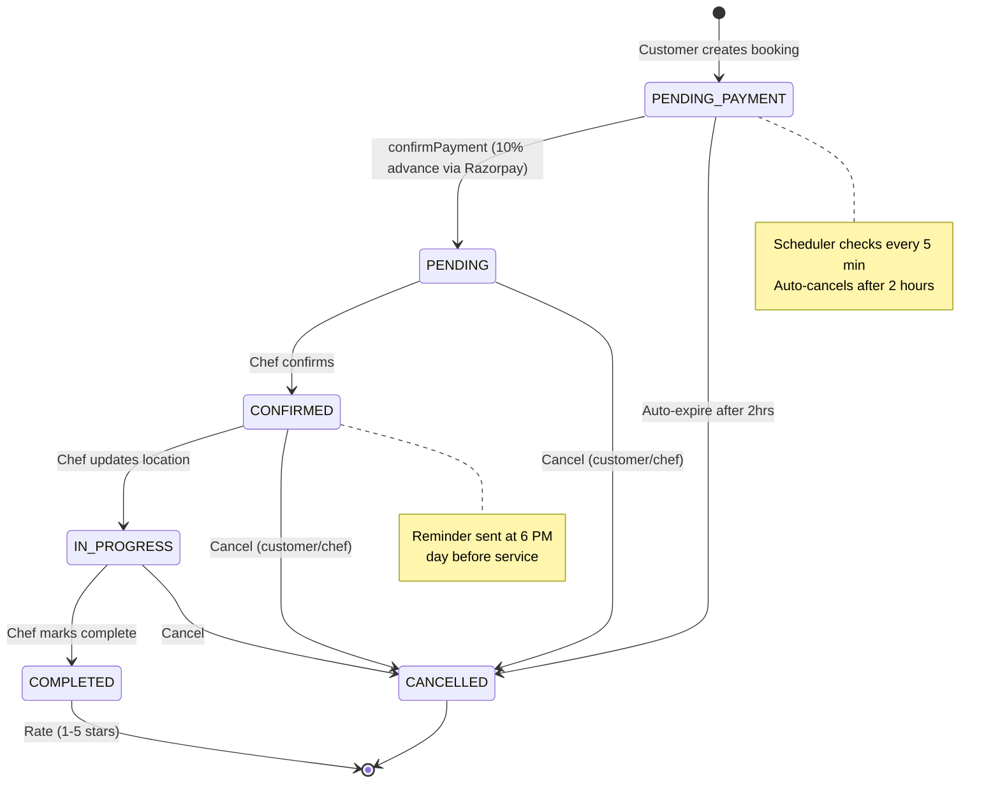
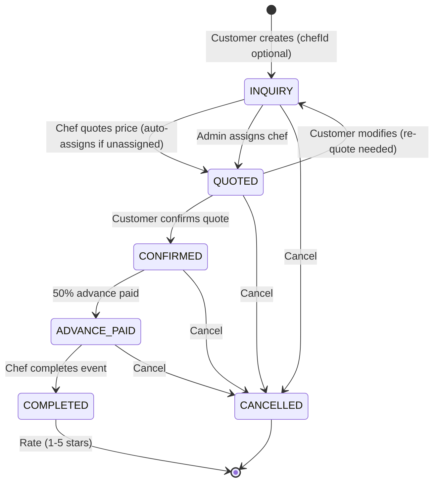
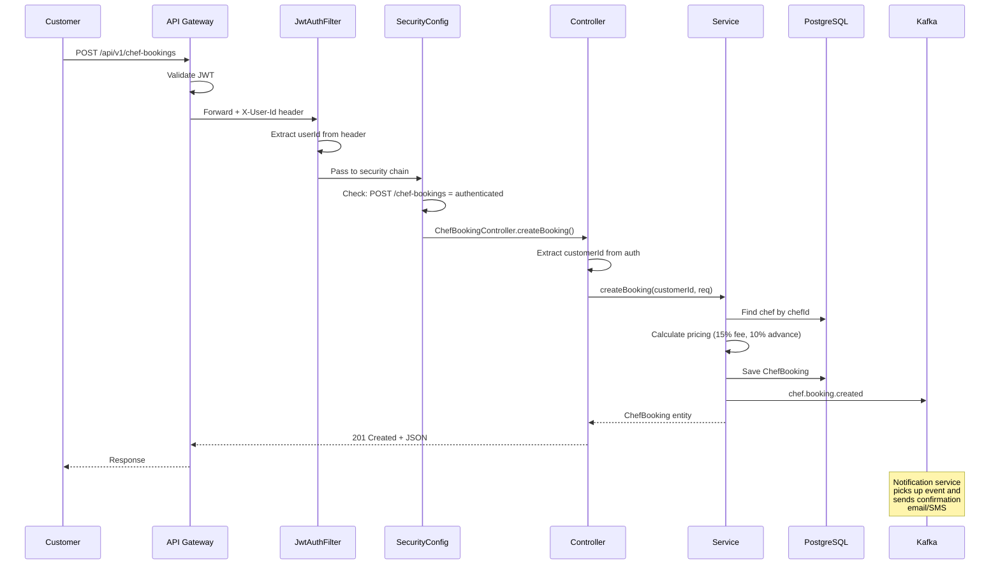
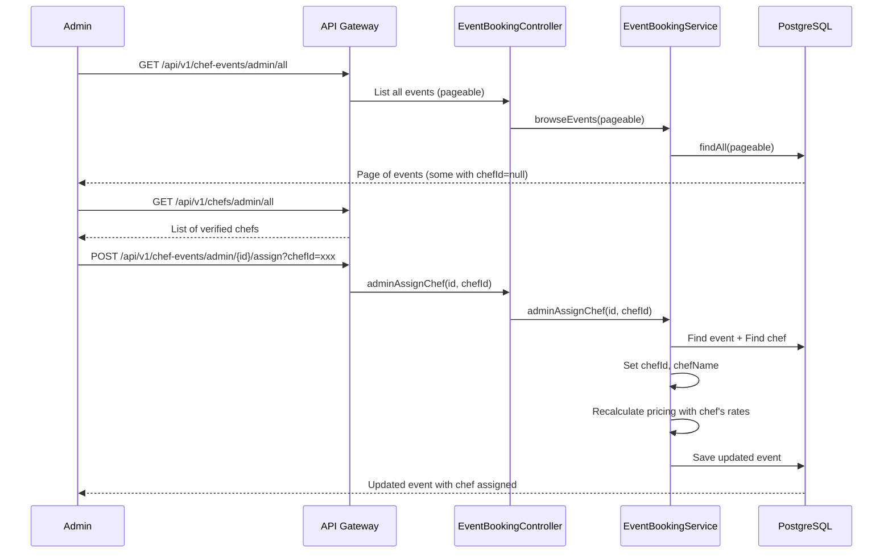
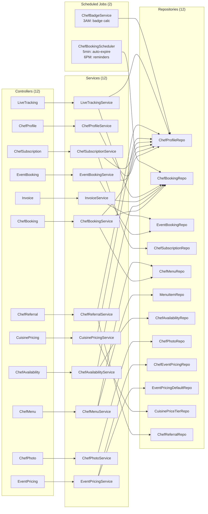

# Chef Service - Mermaid Diagrams

## 1. System Context Diagram

## 2. Entity Relationship Diagram

```mermaid
erDiagram
    chef_profiles ||--o{ chef_bookings : "receives"
    chef_profiles ||--o{ event_bookings : "handles"
    chef_profiles ||--o{ chef_subscriptions : "provides"
    chef_profiles ||--o{ chef_menus : "creates"
    chef_profiles ||--o{ chef_availability : "blocks"
    chef_profiles ||--o{ chef_photos : "uploads"
    chef_profiles ||--o{ chef_event_pricing : "customizes"
    chef_profiles ||--o{ cuisine_price_tiers : "sets"
    chef_profiles ||--o{ chef_referrals : "refers"
    chef_menus ||--o{ menu_items : "contains"

    chef_profiles {
        UUID id PK
        UUID userId UK
        string name
        enum chefType "DOMESTIC|PROFESSIONAL|EVENT_SPECIALIST"
        string city
        string cuisines
        long dailyRatePaise
        long monthlyRatePaise
        long eventMinPlatePaise
        double rating
        int reviewCount
        int totalBookings
        enum verificationStatus "PENDING|VERIFIED|REJECTED|SUSPENDED"
        boolean available
        string badge
        string referralCode UK
    }

    chef_bookings {
        UUID id PK
        string bookingRef UK "SC-XXXXXXXX"
        UUID chefId FK
        UUID customerId
        enum serviceType "DAILY|MONTHLY|EVENT"
        enum mealType "BREAKFAST|LUNCH|DINNER|SNACKS|ALL_DAY"
        date serviceDate
        int guestsCount
        long totalAmountPaise
        long advanceAmountPaise "10 pct"
        long platformFeePaise "15 pct"
        string razorpayPaymentId
        enum status "PENDING_PAYMENT|PENDING|CONFIRMED|IN_PROGRESS|COMPLETED|CANCELLED|NO_SHOW"
        int ratingGiven
    }

    event_bookings {
        UUID id PK
        string bookingRef UK "SE-XXXXXXXX"
        UUID chefId FK "nullable"
        UUID customerId
        string eventType
        date eventDate
        int guestCount
        long totalFoodPaise
        long decorationPaise
        long cakePaise
        long staffPaise
        long totalAmountPaise
        long advanceAmountPaise "50 pct"
        long platformFeePaise "15 pct"
        enum status "INQUIRY|QUOTED|CONFIRMED|ADVANCE_PAID|IN_PROGRESS|COMPLETED|CANCELLED"
    }

    chef_subscriptions {
        UUID id PK
        string subscriptionRef UK "SS-XXXXXXXX"
        UUID chefId FK
        UUID customerId
        string plan
        int mealsPerDay
        long monthlyRatePaise
        long platformFeePaise "10 pct"
        date startDate
        date endDate
        enum status "ACTIVE|PAUSED|CANCELLED|EXPIRED"
    }

    chef_menus {
        UUID id PK
        UUID chefId FK
        string name
        enum serviceType
        enum cuisineType "22 types"
        long pricePerPlatePaise
        boolean isVeg
    }

    menu_items {
        UUID id PK
        UUID menuId FK
        string name
        string category
        boolean isVeg
    }

    chef_availability {
        UUID id PK
        UUID chefId FK
        date blockedDate
        string reason
    }

    chef_photos {
        UUID id PK
        UUID chefId FK
        string url
        string photoType "FOOD|PROFILE|KITCHEN"
    }

    chef_event_pricing {
        UUID id PK
        UUID chefId FK
        string itemKey
        long customPricePaise
    }

    event_pricing_defaults {
        UUID id PK
        string category "BASE_CONFIG|LIVE_COUNTER|ADDON"
        string itemKey UK
        long defaultPricePaise
        string priceType "FIXED|PER_PLATE|PER_PERSON|PERCENTAGE"
    }

    cuisine_price_tiers {
        UUID id PK
        UUID chefId FK
        string cuisineType
        long pricePerPlatePaise
    }

    chef_referrals {
        UUID id PK
        UUID referrerId FK
        UUID referredChefId
        long bonusPaise "Rs 500"
        string status "PENDING|PAID"
    }
```

## 3. Chef Booking State Machine

## 4. Event Booking State Machine

## 5. Request Flow Sequence

## 6. Admin Cook Assignment Flow

## 7. Component Architecture

