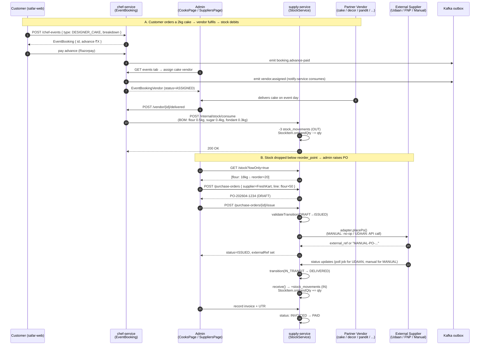
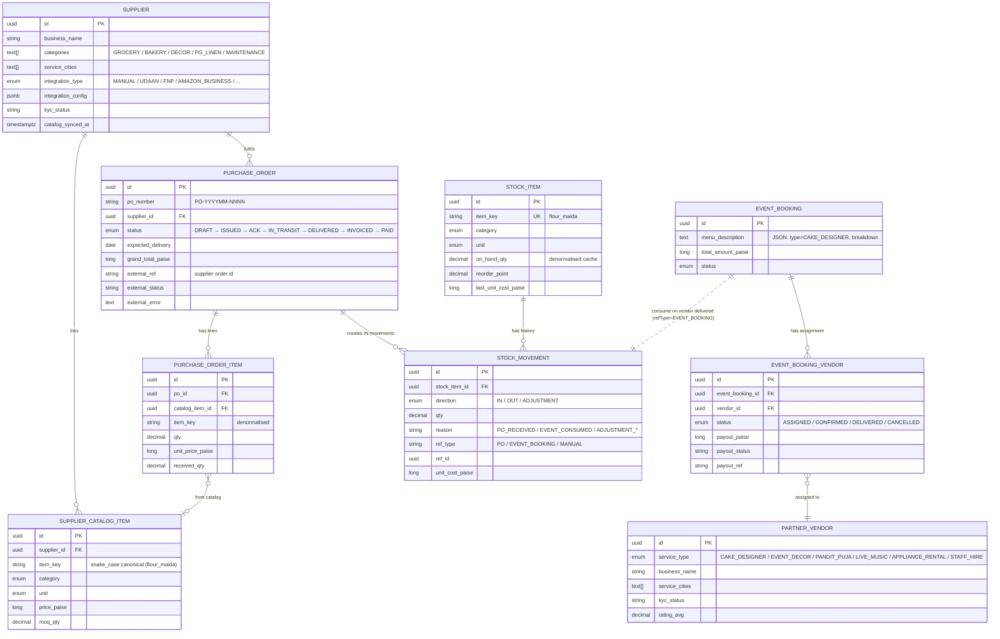
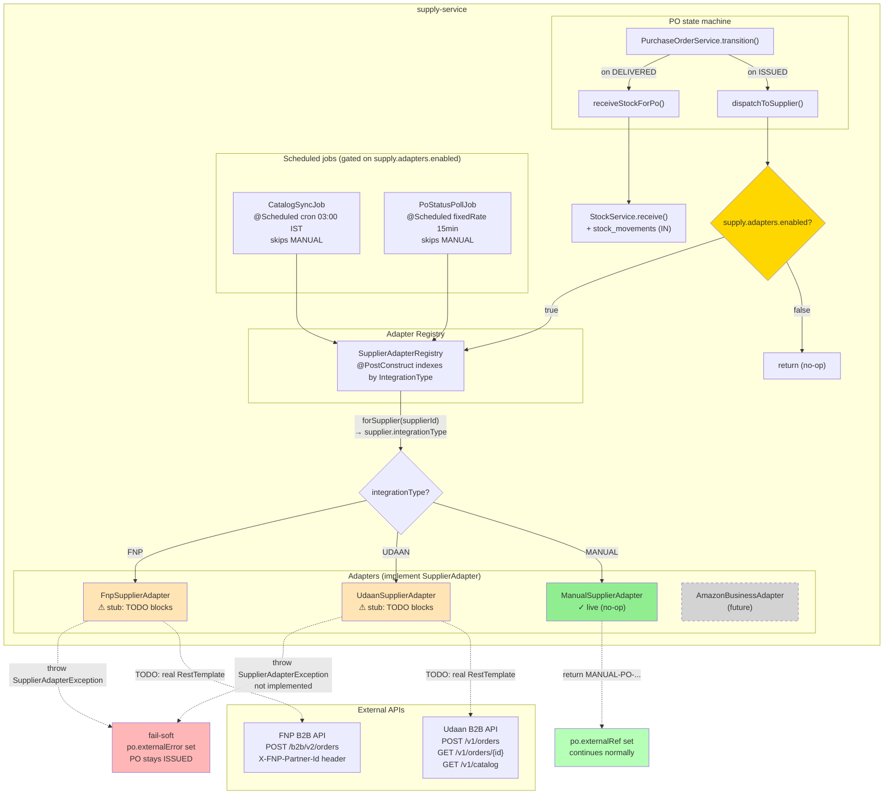
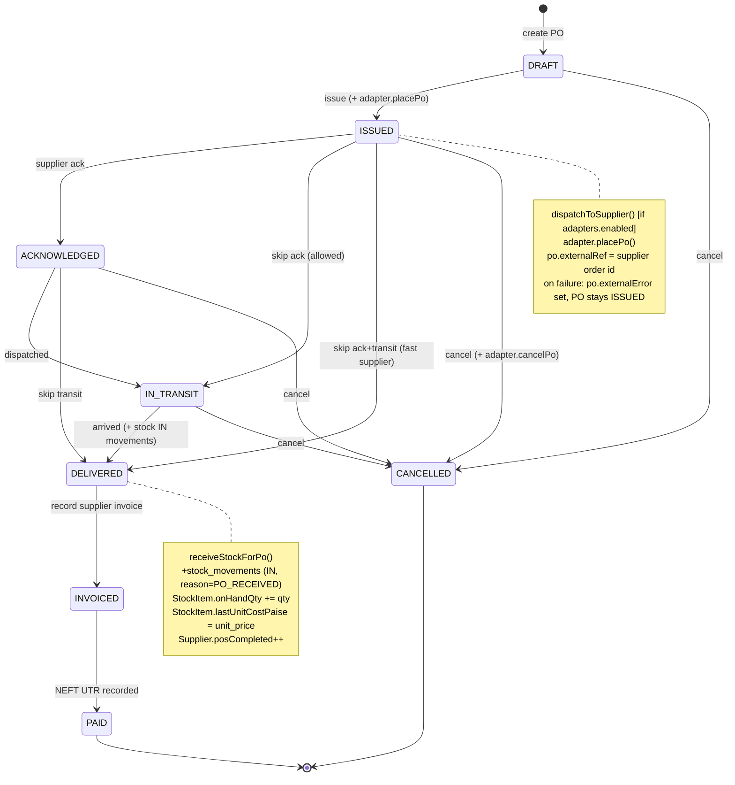

# Supply Chain — Architecture Diagrams

Three views: **end-to-end flow**, **domain entities**, **adapter framework**.

All diagrams are mermaid — render at https://mermaid.live or in any GitHub-flavoured-markdown viewer.

---

## 1. End-to-end flow: customer order → vendor fulfils → stock debits → PO replenishes

---

## 2. Domain entities + relationships

**Key relationships:**
- `partner_vendors` (chef-service, schema `chefs`) sell **TO** customers via `event_booking_vendor` join
- `suppliers` (supply-service, schema `supply`) sell **TO** the platform via `purchase_orders`
- They are **separate entities by design** — same shape, different actors, different schemas
- `stock_movements` is the source of truth; `stock_items.on_hand_qty` is a denormalised cache
- Cross-service ref: `EventBooking` consumes stock via REST call to `/internal/stock/consume`; the resulting `stock_movement.ref_id` points back to the booking id

---

## 3. Adapter framework architecture

**Read this diagram as:**
- Yellow diamond is the **master switch** (`supply.adapters.enabled`). When false (default today), the adapter call short-circuits and PO behaves exactly like Phase 1.
- Green block (`ManualSupplierAdapter`) is the **only adapter that's live**. It returns a synthetic `MANUAL-{poNumber}` ref so callers don't special-case "no integration".
- Beige blocks (`Udaan` / `Fnp`) are **stubs** — Spring beans wired correctly, status mapping done, but every HTTP call site throws `SupplierAdapterException("Not implemented")`. Filling them in is ~50 lines of `RestTemplate` per method, gated on real partner sandbox creds.
- Red block (`fail-soft`) shows the safety net: if any adapter throws, the PO stays `ISSUED` locally with `external_error` captured. **No transition ever fails because of an adapter.** Admin sees the error in the drawer and can retry.
- The two `@Scheduled` jobs (catalog sync + status poll) skip `MANUAL` suppliers entirely — they only matter once a real integration goes live.

---

## Bonus: PO state machine (close-up)

---

## Notes on rendering

- These are mermaid-flavoured markdown — render at https://mermaid.live (paste each block) or in any GFM viewer (GitHub PR preview, Cursor preview, Notion, Obsidian)
- For a static export, use the mermaid CLI: `npx -p @mermaid-js/mermaid-cli mmdc -i scm-architecture-diagrams.md -o scm-diagrams.png`
- For inclusion in a slide deck, copy each block to https://mermaid.live and export PNG/SVG

## Where this connects

- PRD: `prd-supply-chain.md` (the "what" + Phase 1/2/3 split)
- Adapter design: `supplier-adapter-design.md` (deeper interface contract + sequence diagrams)
- Partnership runbook: `supplier-partnership-checklist.md` (how to get sandbox creds)
